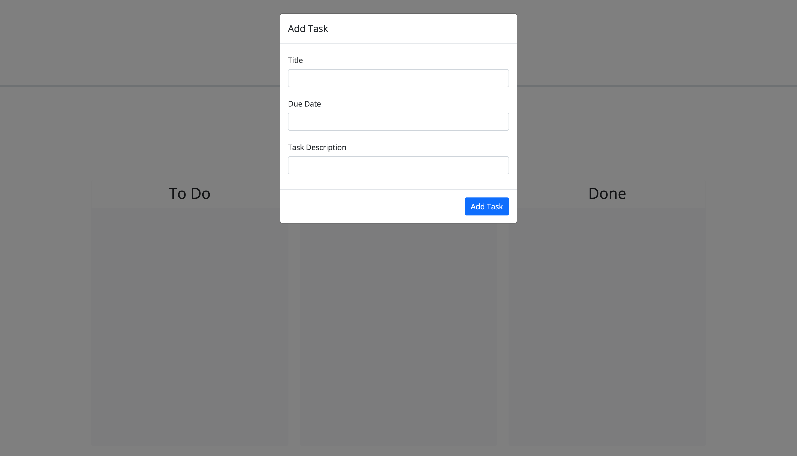

# task-tracker

=================

## Description

This app enables the user to add a task with a title, description and due date. If the task is not yet complete it will get added to the to do lane. If it's overdue it will get added to the incomplete lane. If the task is completed it will get added to the done lane. Depending on the type of task it will be color coordinated and is draggable and droppable. The date picker is also enabled when you attempt to pick the due date of a task. This task tracker helps you to organize your tasks more effectively to help make you more productive. 

## Finished Product 

## Credits
  
  - I used this for help with the draggable and droppable
    - **<https://api.jqueryui.com/droppable/>**

## License

MIT see more details in repo

## Live Link

## GitHub Repo

<https://github.com/joegruff16/task-tracker>
